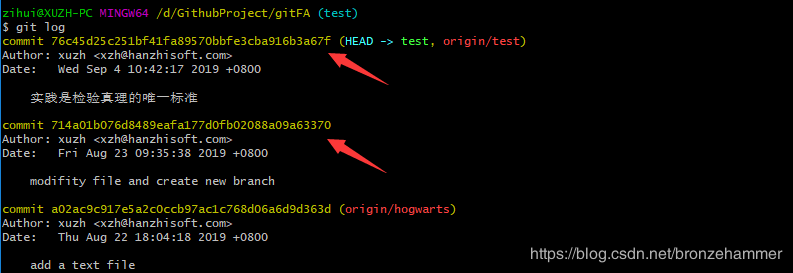
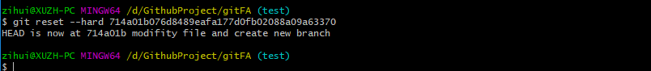
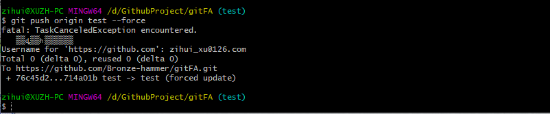

#### 工作流程

+ git status：查看项目当前状态

+ git add :从工作区添加到缓存（例如：git add .  或者 git add 文件路径   或者 touch 1.txt 然后 git add . 将1.txt添加到缓存）

+ git commit:从缓存添加到本地仓库（例如：git commit -m "第一次修改"）

+ git push:从本地仓库推送到远程仓库（例如：git push origin1 dev-hjw）

+ git pull:从远程仓库拉取到工作区

  

#### 分支

+ git branch:查看分支    git branch 分支名：创建分支
+ git checkout 分支名:切换分支
+ git checkout -b 分支名:创建并切换到该分支
+ git merge: 例如我要将 dev-hjw分支 合并到 主分支
  + 先切换到主分支  git branch     git checkout master
  + git merge dev-hjw
  + git push origin master
+ git branch -d 分支名:删除分支
+ git remote: 查看远程连接
  + git remote add origin1 项目远程连接： 添加项目远程连接

#### 不小心把不该push的东西push到了远程分支，怎么办？？

 + 首先  **git log**  查看 commit  的记录，主要是看  ID（图中红色箭头所指）

   

+ 然后 让本地仓库回到提交前的状态   执行命令  **git reset --hard commit的ID**

  

+ 最后  撤回远程仓库的提交  执行命令  **git push origin 分支名 --force**

  

+ 在 github 仓库中查看  分支  上的提交记录（History）发现你要撤回的提交消失了，成功。