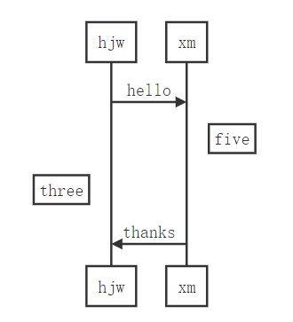
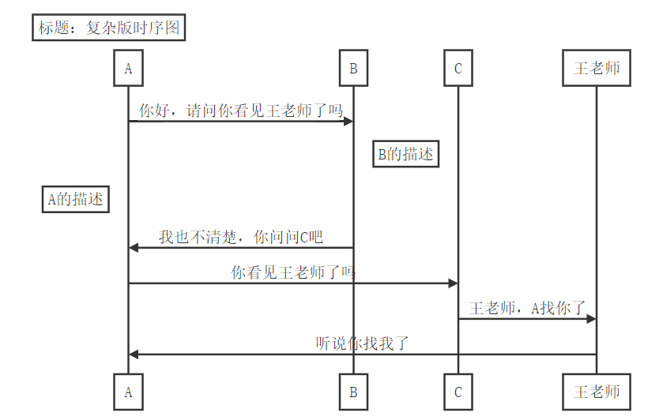
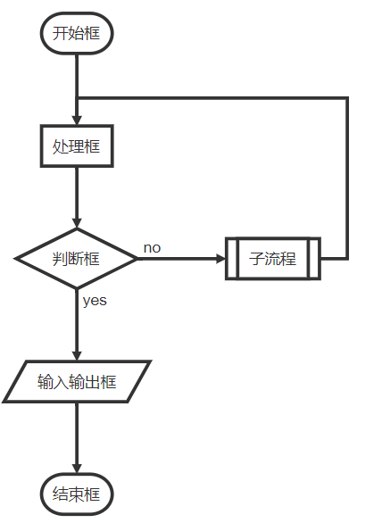

## Typora绘图


#### 依托于[js-sequence](https://bramp.github.io/js-sequence-diagrams/)来实现

+ 时序图

  ​	首先确定对应的语言，例如  **````sequence`**   确定是用 sequence 语言来绘制，然后根据语法绘制想要的图形


​			上面图片中的语句绘制的图如下



+ 复杂版时序图

  

  ​		上面图片中的语句绘制的图如下
  
  
  
  

#### 依托于[flowchart.js](http://flowchart.js.org/)来实现

 + 流程图

   
   
   ​		上面图片中的语句绘制的图如下

