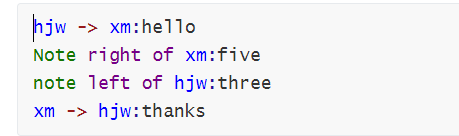
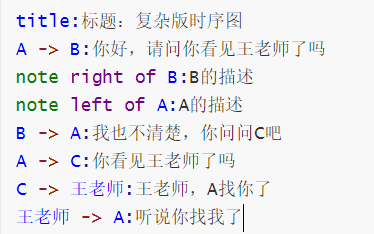
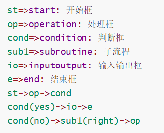

## Typora绘图


#### 依托于[js-sequence](https://bramp.github.io/js-sequence-diagrams/)来实现

+ 时序图



```sequence
hjw -> xm:hello
Note right of xm:five
note left of hjw:three
xm -> hjw:thanks
```

+ 复杂版时序图

  

  ```sequence
  title:标题：复杂版时序图
  A -> B:你好，请问你看见王老师了吗
  note right of B:B的描述
  note left of A:A的描述
  B -> A:我也不清楚，你问问C吧
  A -> C:你看见王老师了吗
  C -> 王老师:王老师，A找你了
  王老师 -> A:听说你找我了
  ```

  

#### 依托于[flowchart.js](http://flowchart.js.org/)来实现

 + 流程图

   

```flow
st=>start: 开始框
op=>operation: 处理框
cond=>condition: 判断框
sub1=>subroutine: 子流程
io=>inputoutput: 输入输出框
e=>end: 结束框
st->op->cond
cond(yes)->io->e
cond(no)->sub1(right)->op

```

