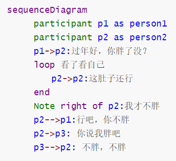

## Typora绘图


#### 依托于[js-sequence](https://bramp.github.io/js-sequence-diagrams/)来实现

+ 时序图

  ​	首先确定对应的语言，例如  **`  ```sequence  `**   确定是用 sequence 语言来绘制，然后根据语法绘制想要的图形


​			上面图片中的语句绘制的图如下


+ 复杂版时序图

  

  ​		上面图片中的语句绘制的图如下
  
  
  
  

#### 依托于[flowchart.js](http://flowchart.js.org/)来实现

 + 流程图

   ​	首先确定对应的语言，例如  **`  ```flow  `**   确定是用 flowchart 语言来绘制，然后根据语法绘制想要的图形
   
   
   
   ​		''=>''前面那些''st","op"可以看做是变量，只要保持前后一致即可，而那些红色的"start","operation"相当于关键字，就必须这样写
   
   ​		上面图片中的语句绘制的图如下

 

#### 依托于 [Mermaid](https://mermaidjs.github.io/) 来实现

 + 时序图

   ​	首先确定对应的语言，例如  **`  ```mermaid  `**   确定是用 Mermaid 语言来绘制，然后根据语法绘制想要的图形

   

   ​	"sequenceDiagram"标志着整个内容的开始

   ​	用  "participant 简称 as 参与者名称"  的语法格式简化名称，下面的描述中就可以用简称代替参与者名称了

   ​	箭头的类型

   ​		|`->`|无箭头的实线|
   ​		|`-->`|无箭头的虚线|
   ​		|`->>`|有箭头的实线|
   ​		|`-->>`|有箭头的虚线|
   ​		|`-x`|末端为叉的实线（表示异步）|
   ​		|`--x`|末端为叉的虚线（表示异步）|

   ​				上面图片中的语句绘制的图如下

