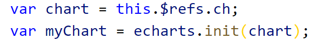

##  Vue中echarts的使用

+ npm install echarts --save   或  cnpm install echarts --save   （加载完可以在package.json中查看到对应的版本）

+ 在  main.js  中引入      import echarts from 'echarts'

+ 在对应页面中引入      import echarts from 'echarts'      或者按需引入

+ 在DOM中设置好具有宽高的盒子

+ 获取到对应的盒子（id或者ref  =>  document.getElementById()  或 this.$ref.名称）

+ 进行初始化（echarts.init()）

  

+ 指定图表的配置项和数据（setOption()）

  + series[{  }]

    + type: 'pie',   指定类型  饼图

    + radius: '80%' ,   指定大小

    + label: { position: 'inner' },  字的位置在饼图上

    + data: [ {value: '105', name: '已落座', selected: true} ] 

        

    + color: ['rgb(207, 235, 194)','#f3726c']  与饼图的颜色对应

